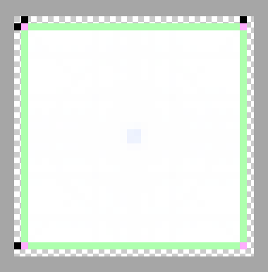

# make-9patched-splash-ionic
This is a node module that do resize & 9-patch ionic project's splash.png automatically like this.




## Dependencies

junkoro/four-sides-1px-9patcher - https://github.com/junkoro/four-sides-1px-9patcher

and this depends on node-canvas.

Automattic/node-canvas - https://github.com/Automattic/node-canvas

Installing node-canvas is bit difficult. Here is how to on mac.

```bash
$ brew install pkg-config
$ brew install pixman
$ brew install cairo
$ export PKG_CONFIG_PATH=/opt/X11/lib/pkgconfig
```

## Installation
```bash
$ npm install make-9patched-splash-ionic
$ cp node_modules/make-9patched-splash-ionic/make-9patched-splash-ionic.js .
```

## Usage
```bash
$ node make-9patched-splash-ionic.js
```
**!!!! DANGER !!!!**

This script will **delete all PNG files** under resources/android/splash, so watch out!


and we need to edit the config.xml like this.（add '.9' extension for each PNG）


**UPDATE 2015.05.06**: Now the script edit config.xml automatically. So no more needs to do this!


```xml
・・・
<splash src="resources/android/splash/drawable-land-ldpi-screen.9.png" density="land-ldpi"/>
<splash src="resources/android/splash/drawable-land-mdpi-screen.9.png" density="land-mdpi"/>
<splash src="resources/android/splash/drawable-land-hdpi-screen.9.png" density="land-hdpi"/>
<splash src="resources/android/splash/drawable-land-xhdpi-screen.9.png" density="land-xhdpi"/>
<splash src="resources/android/splash/drawable-land-xxhdpi-screen.9.png" density="land-xxhdpi"/>
<splash src="resources/android/splash/drawable-land-xxxhdpi-screen.9.png" density="land-xxxhdpi"/>
<splash src="resources/android/splash/drawable-port-ldpi-screen.9.png" density="port-ldpi"/>
<splash src="resources/android/splash/drawable-port-mdpi-screen.9.png" density="port-mdpi"/>
<splash src="resources/android/splash/drawable-port-hdpi-screen.9.png" density="port-hdpi"/>
<splash src="resources/android/splash/drawable-port-xhdpi-screen.9.png" density="port-xhdpi"/>
<splash src="resources/android/splash/drawable-port-xxhdpi-screen.9.png" density="port-xxhdpi"/>
<splash src="resources/android/splash/drawable-port-xxxhdpi-screen.9.png" density="port-xxxhdpi"/>
・・・
```


## License

WTFPL - http://www.wtfpl.net/
